---
## Front matter
lang: ru-RU
title: Лабораторная работа №7
subtitle: Презентация
author:
 - Устинова В. В.
institute:
  - Российский университет дружбы народов, Москва, Россия
date: 18 октября 2025

## i18n babel
babel-lang: russian
babel-otherlangs: english

## Formatting pdf
toc: false
toc-title: Содержание
slide_level: 2
aspectratio: 169
section-titles: true
theme: metropolis
header-includes:
 - \metroset{progressbar=frametitle,sectionpage=progressbar,numbering=fraction}
---

# Информация

## Докладчик

:::::::::::::: {.columns align=center}
::: {.column width="70%"}

 
  * Устинова Виктория Вадимовна
  * студент НПИбд-01-24
  * Российский университет дружбы народов
:::
::: {.column width="30%"}

:::
::::::::::::::

## Цель работы

Получить навыки работы с журналами мониторинга различных событий в системе.

## Задание

1. Продемонстрируйте навыки работы с журналом мониторинга событий в реальном
времени (см. раздел 7.4.1).
2. Продемонстрируйте навыки создания и настройки отдельного файла конфигурации
мониторинга отслеживания событий веб-службы (см. раздел 7.4.2).
3. Продемонстрируйте навыки работы с journalctl (см. раздел 7.4.3).
4. Продемонстрируйте навыки работы с journald (см. раздел 7.4.4).

## Мониторинг журнала системных событий в реальном времени

Запустите три вкладки терминала и в каждом из них получите полномочия администратора.В третьей вкладке терминала вернитесь к учётной записи своего пользователя и попробуйте получить полномочия администратора, но
введите неправильный пароль

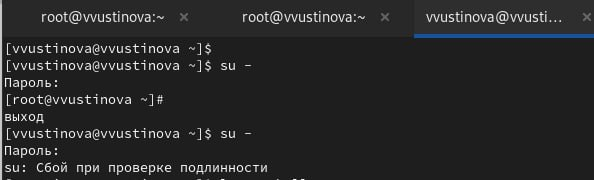{#fig:001 width=70%}

## Мониторинг журнала системных событий в реальном времени

На второй вкладке терминала запустите мониторинг системных событий в реальном времени

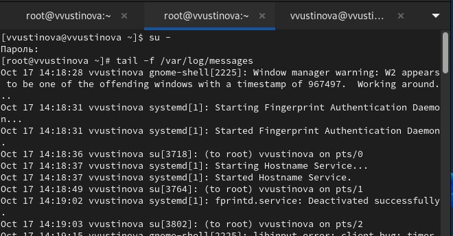{#fig:002 width=70%}

## Мониторинг журнала системных событий в реальном времени

Обратите внимание, что во второй вкладке терминала
с мониторингом событий или ничего не отобразится, или появится сообщение «FAILED SU (to root) username .

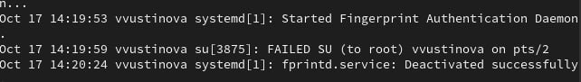{#fig:003 width=70%}

## Мониторинг журнала системных событий в реальном времени

В третьей вкладке терминала из оболочки пользователя введите logger hello 

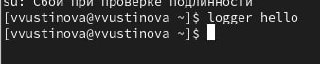{#fig:004 width=70%}

## Мониторинг журнала системных событий в реальном времени

Во второй вкладке терминала с мониторингом событий вы увидите сообщение, которое также будет зафиксировано в файле /var/log/messages.Запустите мониторинг сообщений безопасности (последние 20 строк)

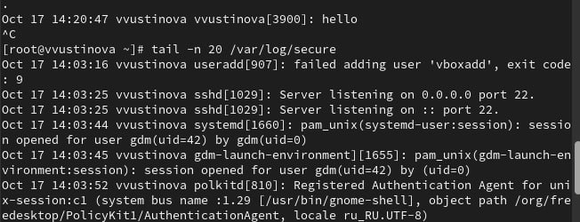{#fig:005 width=70%}

## Изменение правил rsyslog.conf

В первой вкладке терминала установите Apache.После окончания процесса установки запустите веб-службу

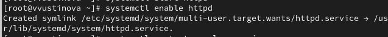{#fig:006 width=70%}

## Изменение правил rsyslog.conf

Во второй вкладке терминала посмотрите журнал сообщений об ошибках веб-службы

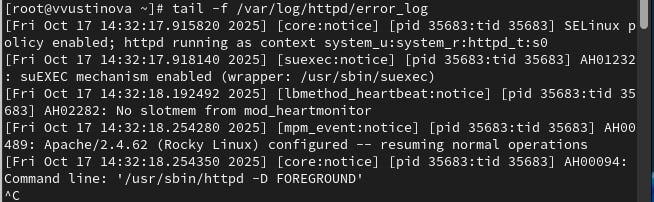{#fig:007 width=70%}

## Изменение правил rsyslog.conf

В третьей вкладке терминала получите полномочия администратора и в файле конфигурации /etc/httpd/conf/httpd.conf в конце добавьте следующую строку

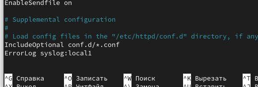{#fig:008 width=70%}

## Изменение правил rsyslog.conf

В каталоге /etc/rsyslog.d создайте файл мониторинга событий веб-службы.Открыв его на редактирование, пропишите в нёмlocal1.* -/var/log/httpd-error.log

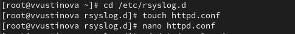{#fig:009 width=70%}

## Изменение правил rsyslog.conf

Перейдите в первую вкладку терминала и перезагрузите конфигурацию rsyslogd и веб-службу

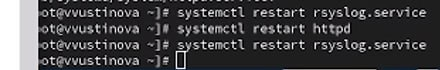{#fig:010 width=70%}

## Изменение правил rsyslog.conf

В третьей вкладке терминала создайте отдельный файл конфигурации для мониторинга отладочной информации. В этом же терминале введите

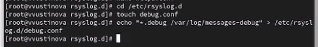{#fig:011 width=70%}

## Изменение правил rsyslog.conf

Во второй вкладке терминала запустите мониторинг отладочной информации:

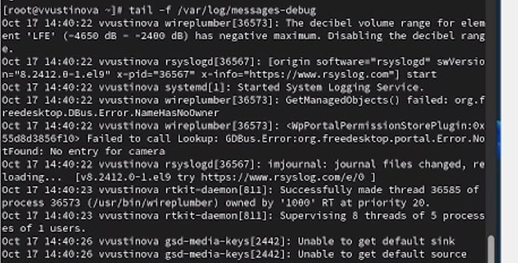{#fig:012 width=70%}

## Изменение правил rsyslog.conf

В третьей вкладке терминала введите:logger -p daemon.debug "Daemon Debug Message"

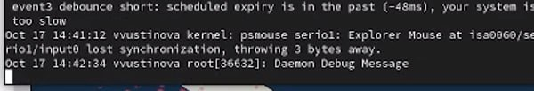{#fig:013 width=70%}

## Использование journalctl

Просмотр содержимого журнала без использования пейджера:

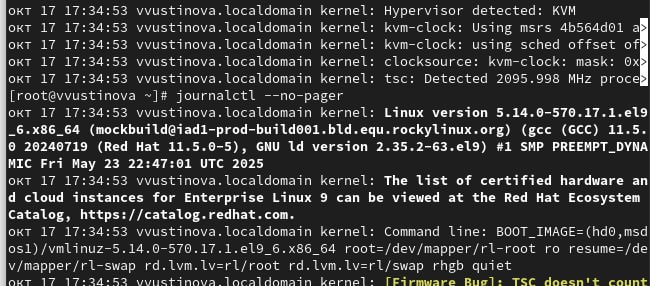{#fig:014 width=70%}

## Использование journalctl

Режим просмотра журнала в реальном времени:
journalctl -f и Просмотрите события для UID0:
journalctl _UID=0

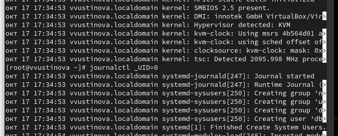{#fig:015 width=70%}

## Использование journalctl

Для отображения последних 20 строк журнала введите и Для просмотра только сообщений об ошибках введите

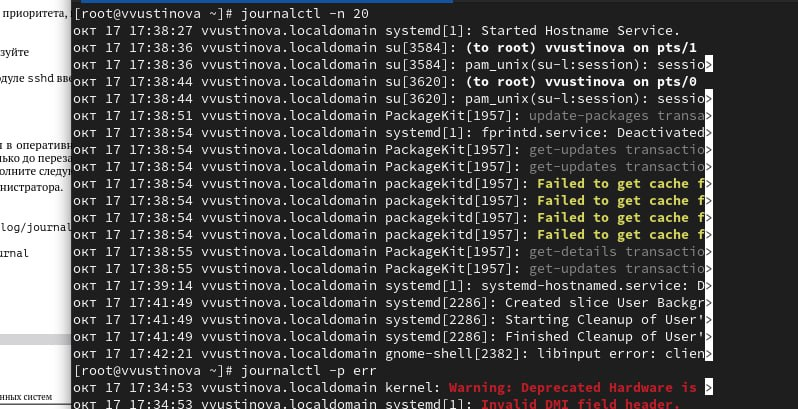{#fig:016 width=70%}

## Использование journalctl

ля просмотра всех сообщений со вчерашнего дня введите
journalctl--since yesterday.Если вы хотите показать все сообщения с ошибкой приоритета, которые были зафиксированы со вчерашнего дня, то используйте journalctl--since yesterday -p err

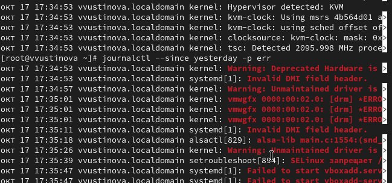{#fig:017 width=70%}

## Использование journalctl

Если вам нужна детальная информация, то используйте journalctl -o verbose Для просмотра дополнительной информации о модуле sshd введите

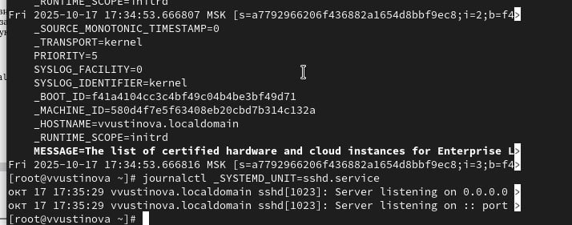{#fig:018 width=70%}

## Постоянный журнал journald

Создаейте каталог, скорректируйте права доступа, Для принятия изменений необходимо или перезагрузить систему, чтобы видеть сообщения журнала с момента последней перезагрузки, используйте

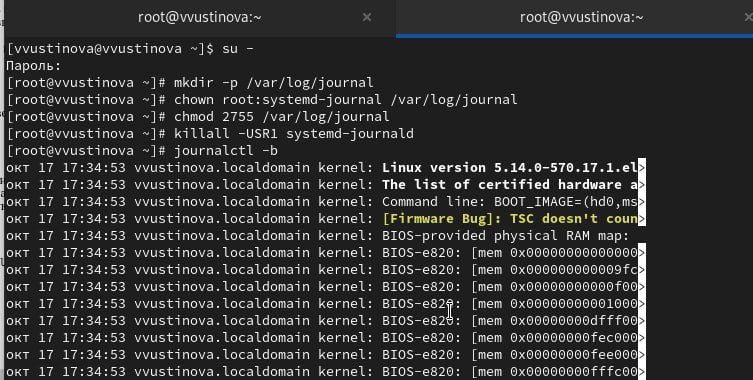{#fig:019 width=70%}

## Выводы

Получить навыки работы с журналами мониторинга различных событий в системе.

