---
## Front matter
title: "Лабораторная работа №7"
subtitle: "Отчет"
author: "Устинова Виктория Вадимовна"

## Generic otions
lang: ru-RU
toc-title: "Содержание"

## Bibliography
bibliography: bib/cite.bib
csl: pandoc/csl/gost-r-7-0-5-2008-numeric.csl

## Pdf output format
toc: true # Table of contents
toc-depth: 2
lof: true # List of figures
lot: true # List of tables
fontsize: 12pt
linestretch: 1.5
papersize: a4
documentclass: scrreprt
## I18n polyglossia
polyglossia-lang:
  name: russian
  options:
	- spelling=modern
	- babelshorthands=true
polyglossia-otherlangs:
  name: english
## I18n babel
babel-lang: russian
babel-otherlangs: english
## Fonts
mainfont: IBM Plex Serif
romanfont: IBM Plex Serif
sansfont: IBM Plex Sans
monofont: IBM Plex Mono
mathfont: STIX Two Math
mainfontoptions: Ligatures=Common,Ligatures=TeX,Scale=0.94
romanfontoptions: Ligatures=Common,Ligatures=TeX,Scale=0.94
sansfontoptions: Ligatures=Common,Ligatures=TeX,Scale=MatchLowercase,Scale=0.94
monofontoptions: Scale=MatchLowercase,Scale=0.94,FakeStretch=0.9
mathfontoptions:
## Biblatex
biblatex: true
biblio-style: "gost-numeric"
biblatexoptions:
  - parentracker=true
  - backend=biber
  - hyperref=auto
  - language=auto
  - autolang=other*
  - citestyle=gost-numeric
## Pandoc-crossref LaTeX customization
figureTitle: "Рис."
tableTitle: "Таблица"
listingTitle: "Листинг"
lofTitle: "Список иллюстраций"
lotTitle: "Список таблиц"
lolTitle: "Листинги"
## Misc options
indent: true
header-includes:
  - \usepackage{indentfirst}
  - \usepackage{float} # keep figures where there are in the text
  - \floatplacement{figure}{H} # keep figures where there are in the text
---

# Цель работы

Получить навыки работы с журналами мониторинга различных событий в системе.

# Задание

1. Продемонстрируйте навыки работы с журналом мониторинга событий в реальном
времени (см. раздел 7.4.1).
2. Продемонстрируйте навыки создания и настройки отдельного файла конфигурации
мониторинга отслеживания событий веб-службы (см. раздел 7.4.2).
3. Продемонстрируйте навыки работы с journalctl (см. раздел 7.4.3).
4. Продемонстрируйте навыки работы с journald (см. раздел 7.4.4).

# Выполнение лабораторной работы

Запустите три вкладки терминала и в каждом из них получите полномочия администратора.В третьей вкладке терминала вернитесь к учётной записи своего пользователя и попробуйте получить полномочия администратора, но
введите неправильный пароль. (рис. [-@fig:001]).

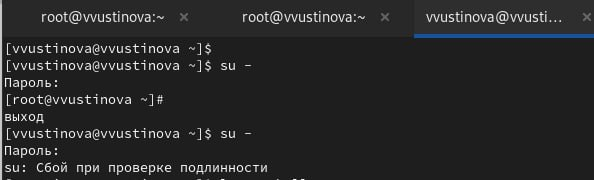{#fig:001 width=70%}

На второй вкладке терминала запустите мониторинг системных событий в реальном времени(рис. [-@fig:002]).

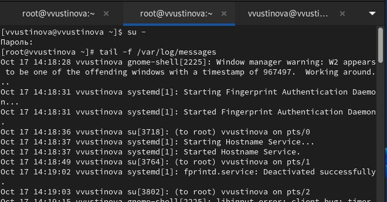{#fig:002 width=70%}

Обратите внимание, что во второй вкладке терминала
с мониторингом событий или ничего не отобразится, или появится сообщение «FAILED SU (to root) username .(рис. [-@fig:003]).

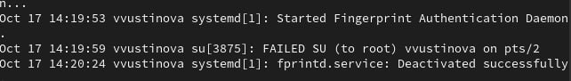{#fig:003 width=70%}

В третьей вкладке терминала из оболочки пользователя введите logger hello (рис. [-@fig:004]).

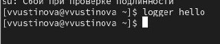{#fig:004 width=70%}

Во второй вкладке терминала с мониторингом событий вы увидите сообщение, которое также будет зафиксировано в файле /var/log/messages.Запустите мониторинг сообщений безопасности (последние 20 строк)(рис. [-@fig:005]).

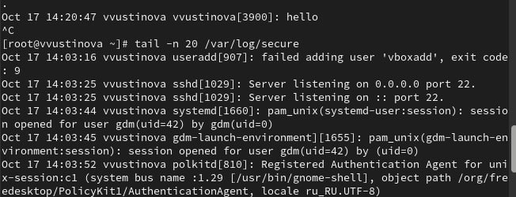{#fig:005 width=70%}

В первой вкладке терминала установите Apache.После окончания процесса установки запустите веб-службу:(рис. [-@fig:006]).

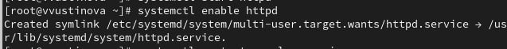{#fig:006 width=70%}

Во второй вкладке терминала посмотрите журнал сообщений об ошибках веб-службы(рис. [-@fig:007]).

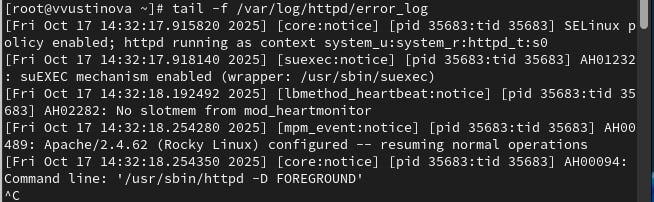{#fig:007 width=70%}

В третьей вкладке терминала получите полномочия администратора и в файле конфигурации /etc/httpd/conf/httpd.conf в конце добавьте следующую строку(рис. [-@fig:008]).

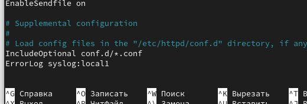{#fig:008 width=70%}

В каталоге /etc/rsyslog.d создайте файл мониторинга событий веб-службы.Открыв его на редактирование, пропишите в нёмlocal1.* -/var/log/httpd-error.log(рис. [-@fig:009]).

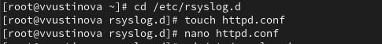{#fig:009 width=70%}

Перейдите в первую вкладку терминала и перезагрузите конфигурацию rsyslogd и веб-службу:(рис. [-@fig:010]).

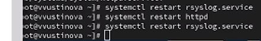{#fig:010 width=70%}

В третьей вкладке терминала создайте отдельный файл конфигурации для мониторинга отладочной информации. В этом же терминале введите(рис. [-@fig:011]).

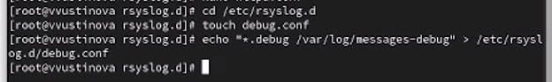{#fig:011 width=70%}

Во второй вкладке терминала запустите мониторинг отладочной информации:(рис. [-@fig:012]).

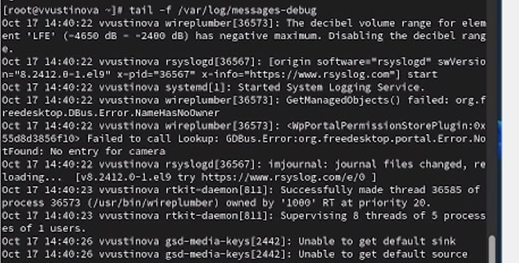{#fig:012 width=70%}

В третьей вкладке терминала введите:logger -p daemon.debug "Daemon Debug Message"(рис. [-@fig:013]).

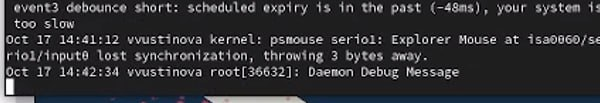{#fig:013 width=70%}

Просмотр содержимого журнала без использования пейджера:(рис. [-@fig:014]).

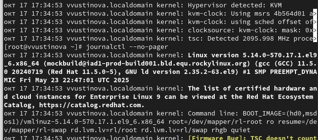{#fig:014 width=70%}

Режим просмотра журнала в реальном времени:
journalctl -f и Просмотрите события для UID0:
journalctl _UID=0(рис. [-@fig:015]).

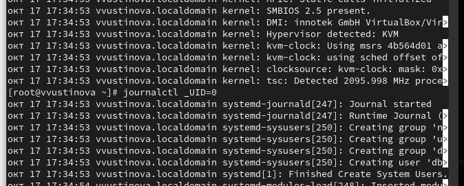{#fig:015 width=70%}

Для отображения последних 20 строк журнала введите и Для просмотра только сообщений об ошибках введите(рис. [-@fig:016]).

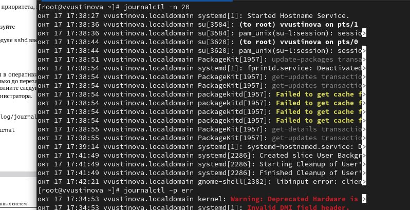{#fig:016 width=70%}

ля просмотра всех сообщений со вчерашнего дня введите
journalctl--since yesterday.Если вы хотите показать все сообщения с ошибкой приоритета, которые были зафиксированы со вчерашнего дня, то используйте journalctl--since yesterday -p err(рис. [-@fig:017]).

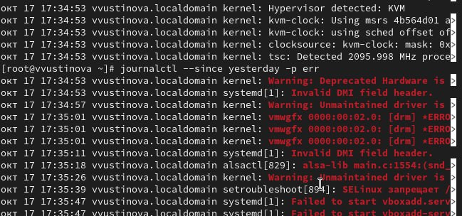{#fig:017 width=70%}

Если вам нужна детальная информация, то используйте journalctl -o verbose Для просмотра дополнительной информации о модуле sshd введите(рис. [-@fig:018]).

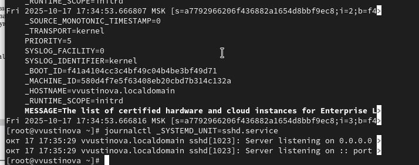{#fig:018 width=70%}

Создаейте каталог, скорректируйте права доступа, Для принятия изменений необходимо или перезагрузить систему, чтобы видеть сообщения журнала с момента последней перезагрузки, используйте:(рис. [-@fig:019]).

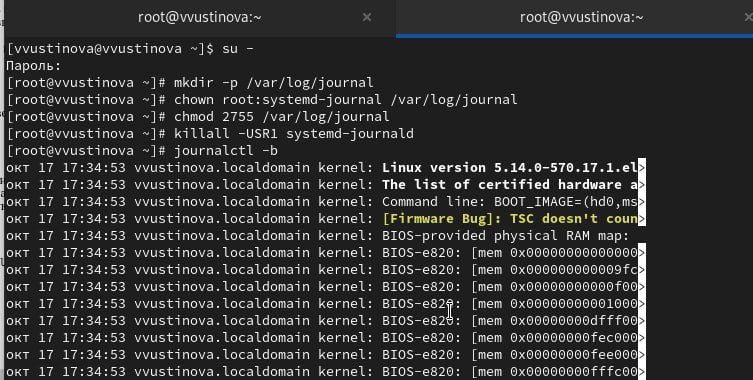{#fig:019 width=70%}

# Выводы

Получить навыки работы с журналами мониторинга различных событий в системе.

# Ответы на контрольные вопросы

1. Файл конфигурации rsyslogd: /etc/rsyslog.conf (или файлы в /etc/rsyslog.d/, включенные в /etc/rsyslog.conf).

2. Файл журнала аутентификации rsyslogd: /var/log/auth.log или /var/log/secure (зависит от конфигурации).

3. Период ротации журналов по умолчанию: Еженедельно (weekly).

4. Строка конфигурации для записи сообщений info в /var/log/messages.info: *.info /var/log/messages.info

5. Команда для просмотра журналов в реальном времени: Rsyslog: tail -f /var/log/syslog Journald: journalctl -f

6. Команда для просмотра сообщений PID 1 между 9:00 и 15:00 (journald): journalctl _PID=1 --since "09:00" --until "15:00"

7. Команда для просмотра сообщений journald после последней перезагрузки: journalctl -b

8. Процедура для обеспечения постоянного хранения журналов journald: sudo mkdir /var/log/journal sudo systemctl restart systemd-journald
