---
## Front matter
title: "Лабораторная работа №8"
subtitle: "Отчет"
author: "Устинова Виктория Вадимовна"

## Generic otions
lang: ru-RU
toc-title: "Содержание"

## Bibliography
bibliography: bib/cite.bib
csl: pandoc/csl/gost-r-7-0-5-2008-numeric.csl

## Pdf output format
toc: true # Table of contents
toc-depth: 2
lof: true # List of figures
lot: true # List of tables
fontsize: 12pt
linestretch: 1.5
papersize: a4
documentclass: scrreprt
## I18n polyglossia
polyglossia-lang:
  name: russian
  options:
	- spelling=modern
	- babelshorthands=true
polyglossia-otherlangs:
  name: english
## I18n babel
babel-lang: russian
babel-otherlangs: english
## Fonts
mainfont: IBM Plex Serif
romanfont: IBM Plex Serif
sansfont: IBM Plex Sans
monofont: IBM Plex Mono
mathfont: STIX Two Math
mainfontoptions: Ligatures=Common,Ligatures=TeX,Scale=0.94
romanfontoptions: Ligatures=Common,Ligatures=TeX,Scale=0.94
sansfontoptions: Ligatures=Common,Ligatures=TeX,Scale=MatchLowercase,Scale=0.94
monofontoptions: Scale=MatchLowercase,Scale=0.94,FakeStretch=0.9
mathfontoptions:
## Biblatex
biblatex: true
biblio-style: "gost-numeric"
biblatexoptions:
  - parentracker=true
  - backend=biber
  - hyperref=auto
  - language=auto
  - autolang=other*
  - citestyle=gost-numeric
## Pandoc-crossref LaTeX customization
figureTitle: "Рис."
tableTitle: "Таблица"
listingTitle: "Листинг"
lofTitle: "Список иллюстраций"
lotTitle: "Список таблиц"
lolTitle: "Листинги"
## Misc options
indent: true
header-includes:
  - \usepackage{indentfirst}
  - \usepackage{float} # keep figures where there are in the text
  - \floatplacement{figure}{H} # keep figures where there are in the text
---

# Цель работы

Получение навыков работы с планировщиками событий cron и at

# Задание

1. Выполните задания по планированию задач с помощью crond (см. раздел 8.4.1).
2. Выполните задания по планированию задач с помощью atd (см. раздел 8.4.2)

# Выполнение лабораторной работы

Посмотрите статус демона crond:(рис. [-@fig:001]).

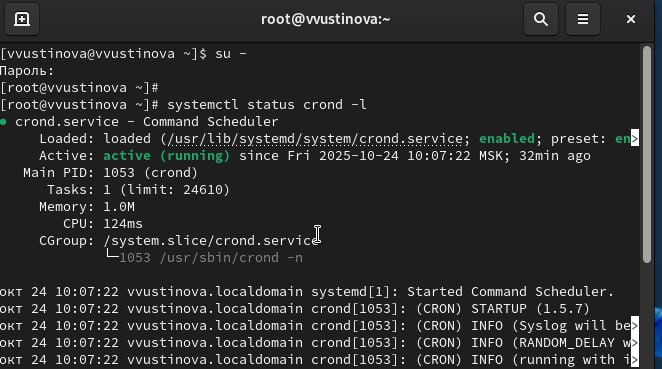{#fig:001 width=70%}

Посмотрите содержимое файла конфигурации /etc/crontab, посмотрите список заданий в расписании(рис. [-@fig:002]).

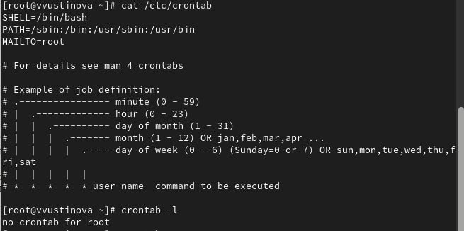{#fig:002 width=70%}

Откройте файл расписания на редактирование и добавьте следующую строку в файл расписания (рис. [-@fig:003]).

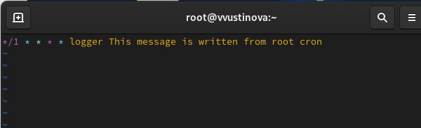{#fig:003 width=70%}

Посмотрите список заданий в расписании(рис. [-@fig:004]).

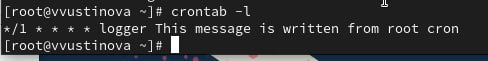{#fig:004 width=70%}

Не выключая систему, через некоторое время (2–3 минуты) просмотрите журнал системных событий(рис. [-@fig:005]).

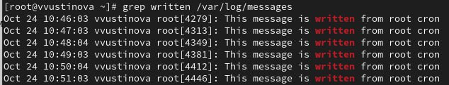{#fig:005 width=70%}

Измените запись в расписании crontab на следующую:
0 */1 **1-5 logger This message is written from root cron и посмотрите список заданий в расписании:(рис. [-@fig:006]).

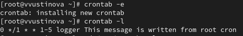{#fig:006 width=70%}

Перейдите в каталог /etc/cron.hourly и создайте в нём файл сценария с именем eachhour,откройте файл для редактирования и пропишите в нём строку, делайте файл сценария eachhour исполняемым: (рис. [-@fig:007]).

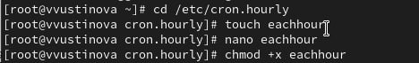{#fig:007 width=70%}

Теперь перейдите в каталог /etc/crond.d и создайте в нём файл с расписанием eachhour, Откройте этот файл для редактирования и поместите в него строчку(рис. [-@fig:008]).

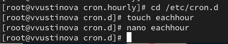{#fig:008 width=70%}

Не выключая систему, через некоторое время (2–3 часа) просмотрите журнал системных событий, По журналу определите, был ли осуществлён запуск сценария eachhour в соответствии с заданным расписанием.(рис. [-@fig:009]).

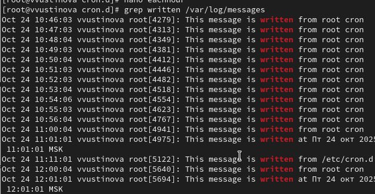{#fig:009 width=70%}

Проверьте, что служба atd загружена и включена(рис. [-@fig:010]).

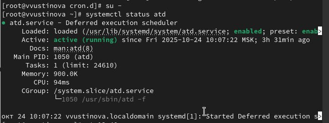{#fig:010 width=70%}

Задайте выполнение команды logger message from at в 9:30 (или замените на любое другое время, когда вы работаете над этим упражнением и введите там logger message from at, убедитесь, что задание действительно запланировано:(рис. [-@fig:011]).

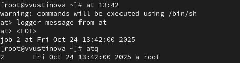{#fig:011 width=70%}

С помощью команды grep 'from at' /var/log/messages посмотрите, появилось ли соответствующее сообщение в лог-файле в указанное вами время(рис. [-@fig:012]).

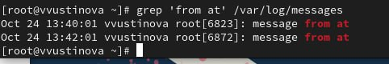{#fig:012 width=70%}

# Выводы

Мы успешно получили навыкы работы с планировщиками событий cron и at

# Ответы на контрольные вопросы

1. Раз в 2 недели: Cron не имеет прямой поддержки. Используйте скрипт, проверяющий дату или параметр date в cron.
2. 1-е и 15-е в 2 ночи: 0 2 1,15   команда
3. Каждые 2 минуты: /2    * команда
4. 19 сентября ежегодно: 0 0 19 9 * команда
5. Четверг сентября ежегодно: 0 0 * 9 4 команда
6. Назначить cron пользователю alice: sudo crontab -u alice -e (может потребоваться sudo)
7. Запретить bob использовать cron: Добавьте bob в /etc/cron.deny.
8. Выполнять задание даже при пропуске: Используйте anacron.
9. Посмотреть запланированные atd задания: atq
