---
## Front matter
lang: ru-RU
title: Лабораторная работа №9
subtitle: Презентация
author:
 - Устинова В. В.
institute:
  - Российский университет дружбы народов, Москва, Россия
date: 31 октября 2025

## i18n babel
babel-lang: russian
babel-otherlangs: english

## Formatting pdf
toc: false
toc-title: Содержание
slide_level: 2
aspectratio: 169
section-titles: true
theme: metropolis
header-includes:
 - \metroset{progressbar=frametitle,sectionpage=progressbar,numbering=fraction}
---

# Информация

## Докладчик

:::::::::::::: {.columns align=center}
::: {.column width="70%"}

  * Устинова Виктория Вадимовна
  * студент НПИбд-01-24
  * Российский университет дружбы народов

:::
::: {.column width="30%"}

:::
::::::::::::::

## Цель работы

Получить навыки работы с контекстом безопасности и политиками SELinux.

## Задание

1. Продемонстрируйте навыки по управлению режимами SELinux (см. раздел 9.4.1).
2. Продемонстрируйте навыки по восстановлению контекста безопасности SELinux (см.
раздел 9.4.2).
3. Настройте контекст безопасности для нестандартного расположения файлов веб-
службы (см. раздел 9.4.3).
4. Продемонстрируйте навыки работы с переключателями SELinux (см. раздел 9.4.4).

## Управление режимами SELinux

Просмотрите текущую информацию о состоянии SELinux

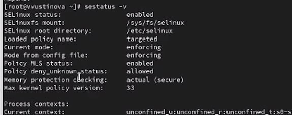{#fig:001 width=70%}

## Управление режимами SELinux

Посмотрите, в каком режиме работает SELinux, измените режим работы SELinux на разрешающий (Permissive)

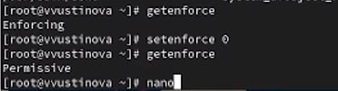{#fig:002 width=70%}

## Управление режимами SELinux

В файле /etc/sysconfig/selinux с помощью редактора установите  disabled

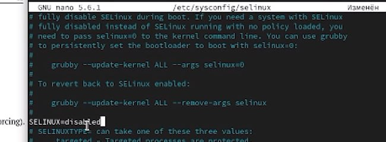{#fig:003 width=70%}

## Управление режимами SELinux

После перезагрузки, посмотрите статус SELinux, попробуйте переключить режим работы SELinux

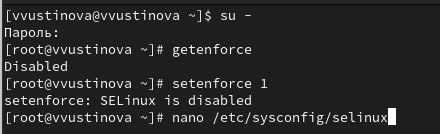{#fig:004 width=70%}

## Управление режимами SELinux

Откройте файл /etc/sysconfig/selinux с помощью редактора и установите enforcing

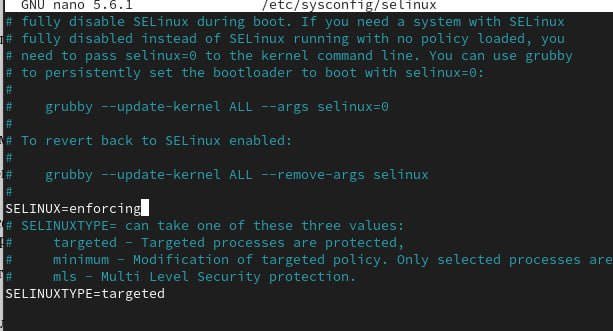{#fig:005 width=70%}

## Управление режимами SELinux

После перезагрузки, убедитесь, что система работает в принудительном режиме (enforcing) использования SELinux.

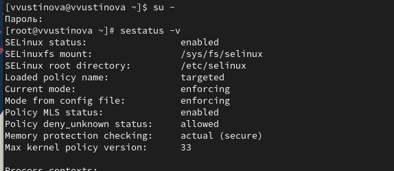{#fig:006 width=70%}

## Использование restorecon для восстановления контекста безопасности

Посмотрите контекст безопасности файла /etc/hosts, Скопируйте файл /etc/hosts в домашний каталог, Проверьте контекст файла ~/hosts

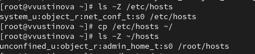{#fig:007 width=70%}

## Использование restorecon для восстановления контекста безопасности

Попытайтесь перезаписать существующий файл hosts из домашнего каталога в каталог /etc, убедитесь, что тип контекста по-прежнему установлен на admin_home_t

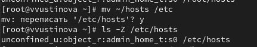{#fig:008 width=70%}

## Использование restorecon для восстановления контекста безопасности

Исправьте контекст безопасности, убедитесь, что тип контекста изменился, для массового исправления контекста безопасности на файловой системе введите

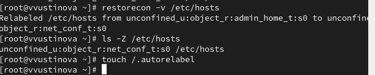{#fig:009 width=70%}

## Использование restorecon для восстановления контекста безопасности

Во время перезапуска не забудьте нажать клавишу Esc на
клавиатуре, чтобы вы видели загрузочные сообщения

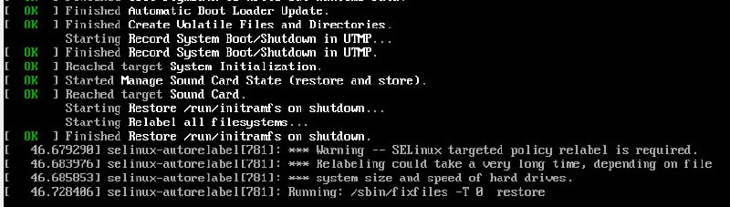{#fig:010 width=70%}

## Настройка контекста безопасности для нестандартного расположения файлов веб-сервера

Создайте новое хранилище для файлов web-сервера, создайте файл index.html в каталоге с контентом веб-сервера, и поместите туда: Welcome to my web-server

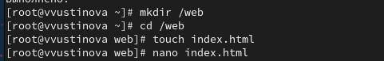{#fig:011 width=70%}

## Настройка контекста безопасности для нестандартного расположения файлов веб-сервера

В файле /etc/httpd/conf/httpd.conf закомментируйте строку
DocumentRoot "/var/www/html" и ниже добавьте строку

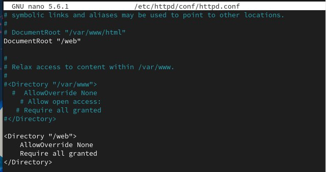{#fig:012 width=70%}

## Настройка контекста безопасности для нестандартного расположения файлов веб-сервера

Запустите веб-сервер и службу httpd, в терминале под учётной записью своего пользователя при обращении к веб-серверу в текстовом браузере lynx, вы увидите веб-страницу Red Hat по умолчанию, а не содержимое только что созданного файла index.html

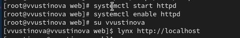{#fig:013 width=70%}

## Настройка контекста безопасности для нестандартного расположения файлов веб-сервера

В терминале с полномочиями администратора примените новую метку контекста к /web, восстановите контекст безопасности

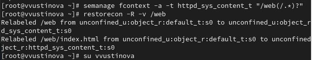{#fig:014 width=70%}

## Настройка контекста безопасности для нестандартного расположения файлов веб-сервера

Теперь вы получите доступ к своей пользовательской веб-странице.В случае успеха на экране должна быть отображена
запись «Welcome to my web-server»

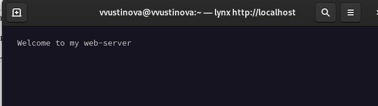{#fig:015 width=70%}

## Работа с переключателями SELinux

Посмотрите список переключателей SELinux для службы ftp, Вы увидите переключатель ftpd_anon_write с текущим значением off, для службы ftpd_anon посмотрите список переключателей 

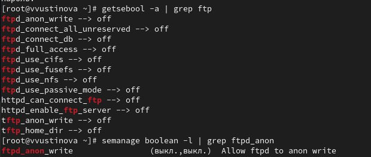{#fig:016 width=70%}

## Работа с переключателями SELinux

Измените текущее значение переключателя для службы ftpd_anon_write с off на on, овторно посмотрите список переключателей SELinux для службы ftpd_anon_write, посмотрите список переключателей с пояснением

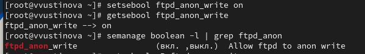{#fig:017 width=70%}

## Работа с переключателями SELinux

Измените постоянное значение переключателя для службы ftpd_anon_write с off на on, посмотрите список переключателей

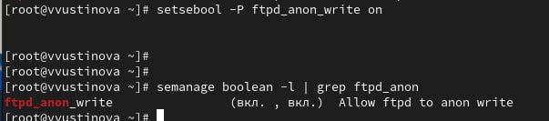{#fig:018 width=70%}

## Выводы

Мы успешно получили навыки работы с контекстом безопасности и политиками SELinux.

