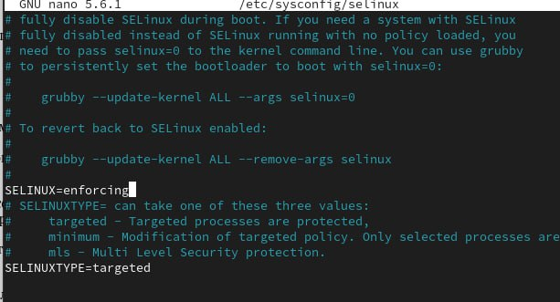

---
## Front matter
title: "Лабораторная работа №9"
subtitle: "Отчет"
author: "Устинова Виктория Вадимовна"

## Generic otions
lang: ru-RU
toc-title: "Содержание"

## Bibliography
bibliography: bib/cite.bib
csl: pandoc/csl/gost-r-7-0-5-2008-numeric.csl

## Pdf output format
toc: true # Table of contents
toc-depth: 2
lof: true # List of figures
lot: true # List of tables
fontsize: 12pt
linestretch: 1.5
papersize: a4
documentclass: scrreprt
## I18n polyglossia
polyglossia-lang:
  name: russian
  options:
	- spelling=modern
	- babelshorthands=true
polyglossia-otherlangs:
  name: english
## I18n babel
babel-lang: russian
babel-otherlangs: english
## Fonts
mainfont: IBM Plex Serif
romanfont: IBM Plex Serif
sansfont: IBM Plex Sans
monofont: IBM Plex Mono
mathfont: STIX Two Math
mainfontoptions: Ligatures=Common,Ligatures=TeX,Scale=0.94
romanfontoptions: Ligatures=Common,Ligatures=TeX,Scale=0.94
sansfontoptions: Ligatures=Common,Ligatures=TeX,Scale=MatchLowercase,Scale=0.94
monofontoptions: Scale=MatchLowercase,Scale=0.94,FakeStretch=0.9
mathfontoptions:
## Biblatex
biblatex: true
biblio-style: "gost-numeric"
biblatexoptions:
  - parentracker=true
  - backend=biber
  - hyperref=auto
  - language=auto
  - autolang=other*
  - citestyle=gost-numeric
## Pandoc-crossref LaTeX customization
figureTitle: "Рис."
tableTitle: "Таблица"
listingTitle: "Листинг"
lofTitle: "Список иллюстраций"
lotTitle: "Список таблиц"
lolTitle: "Листинги"
## Misc options
indent: true
header-includes:
  - \usepackage{indentfirst}
  - \usepackage{float} # keep figures where there are in the text
  - \floatplacement{figure}{H} # keep figures where there are in the text
---

# Цель работы

Получить навыки работы с контекстом безопасности и политиками SELinux.

# Задание

1. Продемонстрируйте навыки по управлению режимами SELinux (см. раздел 9.4.1).
2. Продемонстрируйте навыки по восстановлению контекста безопасности SELinux (см.
раздел 9.4.2).
3. Настройте контекст безопасности для нестандартного расположения файлов веб-
службы (см. раздел 9.4.3).
4. Продемонстрируйте навыки работы с переключателями SELinux (см. раздел 9.4.4).

# Выполнение лабораторной работы

Просмотрите текущую информацию о состоянии SELinux(рис. [-@fig:001]).

{#fig:001 width=70%}

Посмотрите, в каком режиме работает SELinux, измените режим работы SELinux на разрешающий (Permissive)(рис. [-@fig:002]).

{#fig:002 width=70%}

В файле /etc/sysconfig/selinux с помощью редактора установите  disabled(рис. [-@fig:003]).

{#fig:003 width=70%}

После перезагрузки, посмотрите статус SELinux, попробуйте переключить режим работы SELinux(рис. [-@fig:004]).

{#fig:004 width=70%}

Откройте файл /etc/sysconfig/selinux с помощью редактора и установите enforcing(рис. [-@fig:005]).

{#fig:005 width=70%}

После перезагрузки, убедитесь, что система работает в принудительном режиме (enforcing) использования SELinux.(рис. [-@fig:006]).

{#fig:006 width=70%}

Посмотрите контекст безопасности файла /etc/hosts, Скопируйте файл /etc/hosts в домашний каталог, Проверьте контекст файла ~/hosts(рис. [-@fig:007]).

{#fig:007 width=70%}

Попытайтесь перезаписать существующий файл hosts из домашнего каталога в каталог /etc, убедитесь, что тип контекста по-прежнему установлен на admin_home_t(рис. [-@fig:008]).

{#fig:008 width=70%}

Исправьте контекст безопасности, убедитесь, что тип контекста изменился, для массового исправления контекста безопасности на файловой системе введите(рис. [-@fig:009]).

{#fig:009 width=70%}

Во время перезапуска не забудьте нажать клавишу Esc на
клавиатуре, чтобы вы видели загрузочные сообщения(рис. [-@fig:010]).

{#fig:010 width=70%}

Создайте новое хранилище для файлов web-сервера, создайте файл index.html в каталоге с контентом веб-сервера, и поместите туда: Welcome to my web-server(рис. [-@fig:011]).

{#fig:011 width=70%}

В файле /etc/httpd/conf/httpd.conf закомментируйте строку
DocumentRoot "/var/www/html" и ниже добавьте строку(рис. [-@fig:012]).

{#fig:012 width=70%}

Запустите веб-сервер и службу httpd, в терминале под учётной записью своего пользователя при обращении к веб-серверу в текстовом браузере lynx, вы увидите веб-страницу Red Hat по умолчанию, а не содержимое только что созданного файла index.html.(рис. [-@fig:013]).

{#fig:013 width=70%}

В терминале с полномочиями администратора примените новую метку контекста к /web, восстановите контекст безопасности(рис. [-@fig:014]).

{#fig:014 width=70%}

Теперь вы получите доступ к своей пользовательской веб-странице.В случае успеха на экране должна быть отображена
запись «Welcome to my web-server».(рис. [-@fig:015]).

{#fig:015 width=70%}

Посмотрите список переключателей SELinux для службы ftp, Вы увидите переключатель ftpd_anon_write с текущим значением off, для службы ftpd_anon посмотрите список переключателей (рис. [-@fig:016]).

{#fig:016 width=70%}

Измените текущее значение переключателя для службы ftpd_anon_write с off на on, овторно посмотрите список переключателей SELinux для службы ftpd_anon_write, посмотрите список переключателей с пояснением(рис. [-@fig:017]).

{#fig:017 width=70%}

Измените постоянное значение переключателя для службы ftpd_anon_write с off на on, посмотрите список переключателей:(рис. [-@fig:018]).

{#fig:018 width=70%}

# Выводы

Мы успешно получили навыки работы с контекстом безопасности и политиками SELinux.

# Ответы на контрольные вопросы

1. Временно поставить SELinux в разрешающем режиме.
  Для этого используется команда setenforce 0. Это переводит SELinux из режима принудительного выполнения (enforcing), где он блокирует неразрешенные действия, в режим разрешения (permissive), где он лишь регистрирует нарушения, но не блокирует их. Это полезно для диагностики.

2. Список всех доступных переключателей SELinux.
  Чтобы получить полный список всех булевых переключателей SELinux и их текущее состояние, используйте команду semanage boolean -l. Эта команда также покажет краткое описание каждого переключателя.

3. Имя пакета, который требуется установить для получения легко читаемых сообщений журнала SELinux в журнале аудита?
  Для автоматического анализа логов SELinux и получения легко читаемых, интерпретированных сообщений об отказах (denials), а также предложений по их устранению, необходимо установить пакет setroubleshoot-server. Он предоставляет утилиту sealert.

4. Команды, чтобы применить тип контекста httpd_sys_content_t к каталогу /web.
  Для применения файлового контекста httpd_sys_content_t к каталогу /web (и всем его подкаталогам), вам потребуется выполнить две команды:
  •  Сначала добавьте правило для контекста файла: semanage fcontext -a -t httpd_sys_content_t "/web(/.*)?". Эта команда говорит SELinux, что данный тип контекста должен применяться к указанному пути.
  •  Затем примените это правило к файловой системе: restorecon -Rv /web. Эта команда изменит контексты файлов на диске в соответствии с правилами fcontext.

5. Какой файл вам нужно изменить, если вы хотите полностью отключить SELinux?
  Чтобы полностью отключить SELinux, необходимо отредактировать конфигурационный файл /etc/selinux/config. В этом файле нужно найти строку SELINUX=enforcing (или SELINUX=permissive) и изменить ее на SELINUX=disabled. После сохранения файла потребуется перезагрузить систему, чтобы изменения вступили в силу.

6. Где SELinux регистрирует все свои сообщения?
  SELinux регистрирует все свои сообщения, включая отказы доступа (AVC denials) и другие события, в системном журнале аудита. Этот журнал обычно находится по адресу /var/log/audit/audit.log. Просматривать его можно также с помощью утилиты journalctl.

7. Вы не знаете, какие типы контекстов доступны для службы ftp. Какая команда позволяет получить более конкретную информацию?
  Для получения более конкретной информации о контекстах, связанных с FTP, можно использовать следующие команды:
  •  Для просмотра существующих правил файловых контекстов: semanage fcontext -l | grep ftp.
  •  Для просмотра булевых переключателей, влияющих на FTP: semanage boolean -l | grep ftp.
  •  Чтобы узнать, какие типы (types) в политике SELinux существуют для FTP, можно использовать seinfo -t | grep ftp.

8. Сервис работает не так, как ожидалось, и вы хотите узнать, связано ли это с SELinux или чем-то ещё. Какой самый простой способ узнать?
  Самый быстрый способ определить, является ли SELinux причиной проблемы, это временно перевести его в разрешающий режим (permissive) с помощью команды setenforce 0. После этого попробуйте снова запустить проблемный сервис. Если сервис начинает работать нормально, то проблема связана с политикой SELinux. Не забудьте вернуть SELinux в принудительный режим (setenforce 1) после завершения диагностики.
