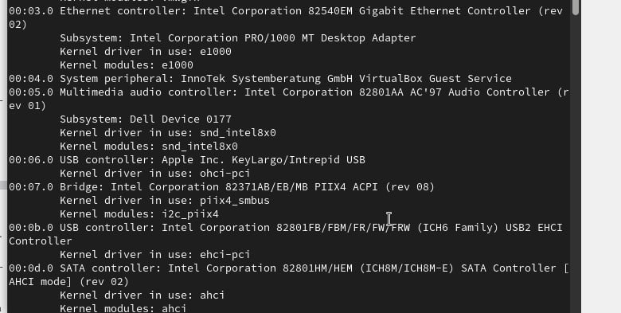
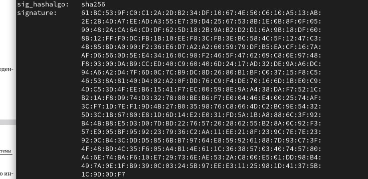
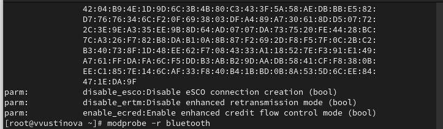
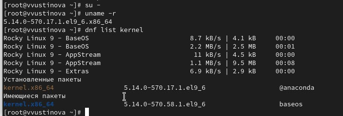
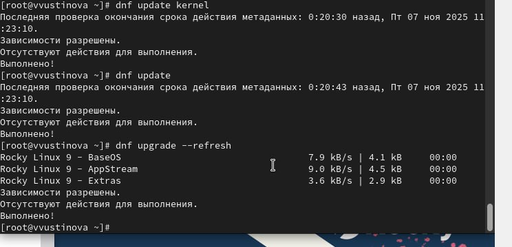

---
## Front matter
lang: ru-RU
title: Лабораторная работа №10
subtitle: Презентация
author:
 - Устинова В. В.
institute:
  - Российский университет дружбы народов, Москва, Россия
date: 07 ноября 2025

## i18n babel
babel-lang: russian
babel-otherlangs: english

## Formatting pdf
toc: false
toc-title: Содержание
slide_level: 2
aspectratio: 169
section-titles: true
theme: metropolis
header-includes:
 - \metroset{progressbar=frametitle,sectionpage=progressbar,numbering=fraction}
---

# Информация

## Докладчик

:::::::::::::: {.columns align=center}
::: {.column width="70%"}

  * Устинова Виктория Вадимовна
  * студент НПИбд-01-24
  * Российский университет дружбы народов
:::
::: {.column width="30%"}

:::
::::::::::::::

## Цель работы

Получить навыки работы с утилитами управления модулями ядра операционной системы.

## Задание

1. Продемонстрируйте навыки работы по управлению модулями ядра (см. раздел 10.4.1).
2. Продемонстрируйте навыки работы по загрузке модулей ядра с параметрами (см.
раздел 10.4.2).

## Управление модулями ядра из командной строки

Посмотрите, какие устройства имеются в вашей системе и какие модули ядра с ними связаны

{#fig:001 width=70%}

## Управление модулями ядра из командной строки

Посмотрите, какие устройства имеются в вашей системе и какие модули ядра с ними связаны

{#fig:002 width=70%}

## Управление модулями ядра из командной строки

Посмотрите, какие модули ядра загружены

{#fig:003 width=70%}

## Управление модулями ядра из командной строки

Посмотрите, загружен ли модуль ext4, загрузите модуль ядра ext4, убедитесь, что модуль загружен, посмотрев список загруженных модулей

{#fig:004 width=70%}

## Управление модулями ядра из командной строки

Посмотрите информацию о модуле ядра ext4, обратите внимание, что у этого модуля нет параметров

{#fig:005 width=70%}

## Управление модулями ядра из командной строки

Попробуйте выгрузить модуль ядра ext4, попробуйте выгрузить модуль ядра xfs

{#fig:006 width=70%}

## Загрузка модулей ядра с параметрами

Посмотрите, загружен ли модуль bluetooth, загрузите модуль ядра bluetooth, посмотрите список модулей ядра, отвечающих за работу с Bluetooth

{#fig:007 width=70%}

## Загрузка модулей ядра с параметрами

Посмотрите информацию о модуле bluetooth

{#fig:008 width=70%}

## Обновление ядра системы

Посмотрите версию ядра, используемую в операционной системе, Выведите на экран список пакетов, относящихся к ядру операционной системы

{#fig:009 width=70%}

## Обновление ядра системы

Обновите систему, чтобы убедиться, что все существующие пакеты обновлены, Обновите ядро операционной системы, а затем саму операционную систему

{#fig:010 width=70%}

## Обновление ядра системы

Посмотрите версию ядра, используемую в операционной системы

{#fig:011 width=70%}

## Выводы

Мы успешно получили навыки работы с утилитами управления модулями ядра операционной системы.

