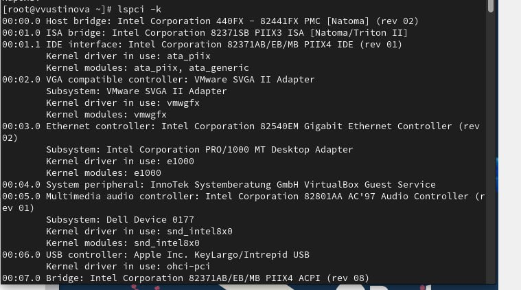
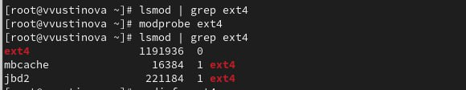
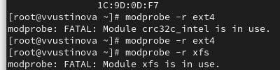
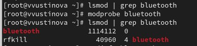
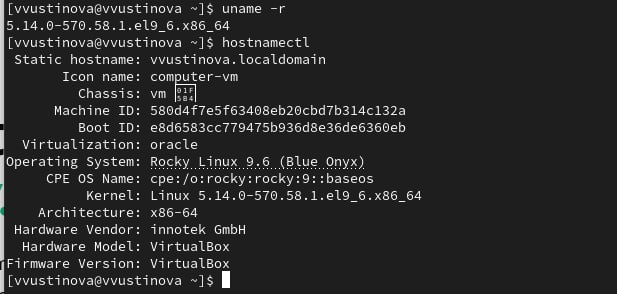

---
## Front matter
title: "Лабораторная работа №10"
subtitle: "Отчет"
author: "Устинова Виктория Вадимовна"

## Generic otions
lang: ru-RU
toc-title: "Содержание"

## Bibliography
bibliography: bib/cite.bib
csl: pandoc/csl/gost-r-7-0-5-2008-numeric.csl

## Pdf output format
toc: true # Table of contents
toc-depth: 2
lof: true # List of figures
lot: true # List of tables
fontsize: 12pt
linestretch: 1.5
papersize: a4
documentclass: scrreprt
## I18n polyglossia
polyglossia-lang:
  name: russian
  options:
	- spelling=modern
	- babelshorthands=true
polyglossia-otherlangs:
  name: english
## I18n babel
babel-lang: russian
babel-otherlangs: english
## Fonts
mainfont: IBM Plex Serif
romanfont: IBM Plex Serif
sansfont: IBM Plex Sans
monofont: IBM Plex Mono
mathfont: STIX Two Math
mainfontoptions: Ligatures=Common,Ligatures=TeX,Scale=0.94
romanfontoptions: Ligatures=Common,Ligatures=TeX,Scale=0.94
sansfontoptions: Ligatures=Common,Ligatures=TeX,Scale=MatchLowercase,Scale=0.94
monofontoptions: Scale=MatchLowercase,Scale=0.94,FakeStretch=0.9
mathfontoptions:
## Biblatex
biblatex: true
biblio-style: "gost-numeric"
biblatexoptions:
  - parentracker=true
  - backend=biber
  - hyperref=auto
  - language=auto
  - autolang=other*
  - citestyle=gost-numeric
## Pandoc-crossref LaTeX customization
figureTitle: "Рис."
tableTitle: "Таблица"
listingTitle: "Листинг"
lofTitle: "Список иллюстраций"
lotTitle: "Список таблиц"
lolTitle: "Листинги"
## Misc options
indent: true
header-includes:
  - \usepackage{indentfirst}
  - \usepackage{float} # keep figures where there are in the text
  - \floatplacement{figure}{H} # keep figures where there are in the text
---

# Цель работы

Получить навыки работы с утилитами управления модулями ядра операционной системы.

# Задание

1. Продемонстрируйте навыки работы по управлению модулями ядра (см. раздел 10.4.1).
2. Продемонстрируйте навыки работы по загрузке модулей ядра с параметрами (см.
раздел 10.4.2).

# Выполнение лабораторной работы

Посмотрите, какие устройства имеются в вашей системе и какие модули ядра с ними связаны(рис. [-@fig:001]).

{#fig:001 width=70%}

Посмотрите, какие устройства имеются в вашей системе и какие модули ядра с ними связаны(рис. [-@fig:002]).

{#fig:002 width=70%}

Посмотрите, какие модули ядра загружены(рис. [-@fig:003]).

{#fig:003 width=70%}

Посмотрите, загружен ли модуль ext4, загрузите модуль ядра ext4, убедитесь, что модуль загружен, посмотрев список загруженных модулей(рис. [-@fig:004]).

{#fig:004 width=70%}

Посмотрите информацию о модуле ядра ext4, обратите внимание, что у этого модуля нет параметров(рис. [-@fig:005]).

{#fig:005 width=70%}

Попробуйте выгрузить модуль ядра ext4, попробуйте выгрузить модуль ядра xfs(рис. [-@fig:006]).

{#fig:006 width=70%}

Посмотрите, загружен ли модуль bluetooth, загрузите модуль ядра bluetooth, посмотрите список модулей ядра, отвечающих за работу с Bluetooth(рис. [-@fig:007]).

{#fig:007 width=70%}

Посмотрите информацию о модуле bluetooth:(рис. [-@fig:008]).

{#fig:008 width=70%}

Посмотрите версию ядра, используемую в операционной системе, Выведите на экран список пакетов, относящихся к ядру операционной системы(рис. [-@fig:009]).

{#fig:009 width=70%}

Обновите систему, чтобы убедиться, что все существующие пакеты обновлены, Обновите ядро операционной системы, а затем саму операционную систему(рис. [-@fig:010]).

{#fig:010 width=70%}

Посмотрите версию ядра, используемую в операционной системы(рис. [-@fig:011]).

{#fig:011 width=70%}

# Выводы

Мы успешно получили навыки работы с утилитами управления модулями ядра операционной системы.

# Ответы на контрольные вопрсосы

1.  Какая команда показывает текущую версию ядра, которая используется на вашей системе?
    uname -r

2.  Как можно посмотреть более подробную информацию о текущей версии ядра операционной системы?
    uname -a

3.  Какая команда показывает список загруженных модулей ядра?
    lsmod

4.  Какая команда позволяет вам определять параметры модуля ядра?
    modinfo <имя_модуля> (параметры показываются в секции parm:)

5.  Как выгрузить модуль ядра?
    modprobe -r <имя_модуля>

6.  Что вы можете сделать, если получите сообщение об ошибке при попытке выгрузить модуль ядра?
    *   Проверить, не используется ли модуль активно (например, файловая система).
    *   Попытаться остановить сервисы или отмонтировать устройства, которые используют этот модуль.
    *   Убедиться, что нет других модулей, зависящих от него.

7.  Как определить, какие параметры модуля ядра поддерживаются?
    modinfo <имя_модуля> (информация о параметрах будет в строках, начинающихся с parm:)

8.  Как установить новую версию ядра?
    Обычно это делается через менеджер пакетов вашей операционной системы (например, sudo apt update && sudo apt upgrade для Debian/Ubuntu или sudo dnf update для Fedora/RHEL). Новые ядра поставляются как пакеты, и система автоматически их устанавливает и настраивает загрузчик.

