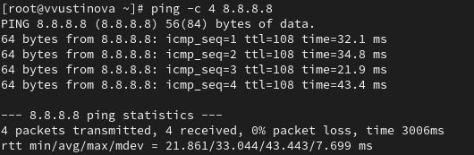

---
## Front matter
title: "Лабораторная работа №12"
subtitle: "Отчет"
author: "Устинова Виктория Вадимовна"

## Generic otions
lang: ru-RU
toc-title: "Содержание"

## Bibliography
bibliography: bib/cite.bib
csl: pandoc/csl/gost-r-7-0-5-2008-numeric.csl

## Pdf output format
toc: true # Table of contents
toc-depth: 2
lof: true # List of figures
lot: true # List of tables
fontsize: 12pt
linestretch: 1.5
papersize: a4
documentclass: scrreprt
## I18n polyglossia
polyglossia-lang:
  name: russian
  options:
	- spelling=modern
	- babelshorthands=true
polyglossia-otherlangs:
  name: english
## I18n babel
babel-lang: russian
babel-otherlangs: english
## Fonts
mainfont: IBM Plex Serif
romanfont: IBM Plex Serif
sansfont: IBM Plex Sans
monofont: IBM Plex Mono
mathfont: STIX Two Math
mainfontoptions: Ligatures=Common,Ligatures=TeX,Scale=0.94
romanfontoptions: Ligatures=Common,Ligatures=TeX,Scale=0.94
sansfontoptions: Ligatures=Common,Ligatures=TeX,Scale=MatchLowercase,Scale=0.94
monofontoptions: Scale=MatchLowercase,Scale=0.94,FakeStretch=0.9
mathfontoptions:
## Biblatex
biblatex: true
biblio-style: "gost-numeric"
biblatexoptions:
  - parentracker=true
  - backend=biber
  - hyperref=auto
  - language=auto
  - autolang=other*
  - citestyle=gost-numeric
## Pandoc-crossref LaTeX customization
figureTitle: "Рис."
tableTitle: "Таблица"
listingTitle: "Листинг"
lofTitle: "Список иллюстраций"
lotTitle: "Список таблиц"
lolTitle: "Листинги"
## Misc options
indent: true
header-includes:
  - \usepackage{indentfirst}
  - \usepackage{float} # keep figures where there are in the text
  - \floatplacement{figure}{H} # keep figures where there are in the text
---

# Цель работы

Получить навыки настройки сетевых параметров системы.

# Задание

1. Продемонстрируйте навыки использования утилиты ip (см. раздел 12.4.1).
2. Продемонстрируйте навыки использования утилиты nmcli (см. раздел 12.4.2 и 12.4.3).

# Выполнение лабораторной работы

Выведите на экран информацию о существующих сетевых подключениях, а также статистику о количестве отправленных пакетов и связанных с ними сообщениях об
ошибках, Выведите на экран информацию о текущих маршрутах(рис. [-@fig:001]).

{#fig:001 width=70%}

Выведите на экран информацию о текущих назначениях адресов для сетевых интерфейсов на устройстве(рис. [-@fig:002]).

{#fig:002 width=70%}

Используйте команду ping для проверки правильности подключения к Интернету. Например, для отправки четырёх пакетов на IP-адрес 8.8.8.8 введите(рис. [-@fig:003]).

{#fig:003 width=70%}

Добавьте дополнительный адрес к вашему интерфейсу, проверьте, что адрес добавился(рис. [-@fig:004]).

{#fig:004 width=70%}

Сравните вывод информации от утилиты ip и от команды ifconfig(рис. [-@fig:005]).

{#fig:005 width=70%}

Выведите на экран список всех прослушиваемых системой портов UDP и TCP(рис. [-@fig:006]).

{#fig:006 width=70%}

Получите полномочия администратора. Выведите на экран информацию о текущих соединениях, добавьте Ethernet-соединение с именем dhcp к интерфейсу:(рис. [-@fig:007]).

{#fig:007 width=70%}

Добавьте к этому же интерфейсу Ethernet-соединение с именем static, статическим IPv4-адресом адаптера и статическим адресом шлюза, Выведите информацию о текущих соединениях:(рис. [-@fig:008]).

{#fig:008 width=70%}

Переключитесь на статическое соединение, Проверьте успешность переключения при помощи nmcli connection show и id addr (рис. [-@fig:009]).

{#fig:009 width=70%}

Вернитесь к соединению dhcp, Проверьте успешность переключения при помощи nmcli connection show(рис. [-@fig:010]).

{#fig:010 width=70%}

Отключите автоподключение статического соединения, Добавьте DNS-сервер в статическое соединение, Для добавления второго и последующих элементов для тех же параметров используется знак +, добавьте другой IP-адрес для статического соединения:(рис. [-@fig:011]).

{#fig:011 width=70%}

После изменения свойств соединения активируйте его, Проверьте успешность переключения при помощи(рис. [-@fig:012]).

{#fig:012 width=70%}

Используя nmtui, посмотрите и опишите в отчёте настройки сети на устройстве(рис. [-@fig:013]).

{#fig:013 width=70%}

Посмотрите настройки сетевых соединений в графическом интерфейсе операционной системы.(рис. [-@fig:014]).

{#fig:014 width=70%}

 Переключитесь на первоначальное сетевое соединение(рис. [-@fig:015]).

{#fig:015 width=70%}

# Выводы

Мы успешно получили навыки настройки сетевых параметров системы.

# Ответы на контрольные вопросы

1. nmcli device status — показывает перечень устройств и их состояние (STATE, CONNECTION) без подробных IP‑адресов. Это удобная команда, чтобы быстро увидеть, какие интерфейсы активны или отключены.

2. NetworkManager (systemd-служба: NetworkManager.service) — стандартный менеджер сети в современных RHEL/CentOS/AlmaLinux. На старых установках мог использоваться демон network (network.service), но сейчас по умолчанию управляет NetworkManager.

3. /etc/hostname — в этом файле хранится постоянное имя хоста (hostname) в RHEL. Дополнительно имя может повторяться в /etc/hosts или быть задано в /etc/sysconfig/network в старых конфигурациях.

4. Для постоянной установки имени используйте sudo hostnamectl set-hostname new-hostname. Временно (до перезагрузки) можно задать имя командой sudo hostname new-hostname.

5. /etc/hosts — сюда добавляют строку вида 192.168.1.10 myserver.local myserver для статического разрешения имени в конкретный IP. Это простой способ привязать имя к адресу без использования DNS.

6. ip route show — показывает текущую таблицу маршрутизации, включая маршрут по умолчанию и сети. Альтернативно можно использовать устаревшую route -n, но ip route — современный и предпочтительный инструмент.

7. systemctl status NetworkManager.service — даёт подробный статус службы, логи и состояние. Для быстрого ответа «активна/неактивна» используйте systemctl is-active NetworkManager.

8. Для постоянного изменения через NetworkManager используйте: sudo nmcli connection modify "CONN_NAME" ipv4.addresses 192.168.1.50/24 ipv4.gateway 192.168.1.1 ipv4.method manual затем sudo nmcli connection up "CONN_NAME". Временный (без сохранения) вариант — sudo ip addr add 192.168.1.50/24 dev eth0 и sudo ip route replace default via 192.168.1.1 dev eth0.
