---
## Front matter
title: "Лабораторная работа №13"
subtitle: "Отчет"
author: "Устинова Виктория Вадимовна"

## Generic otions
lang: ru-RU
toc-title: "Содержание"

## Bibliography
bibliography: bib/cite.bib
csl: pandoc/csl/gost-r-7-0-5-2008-numeric.csl

## Pdf output format
toc: true # Table of contents
toc-depth: 2
lof: true # List of figures
lot: true # List of tables
fontsize: 12pt
linestretch: 1.5
papersize: a4
documentclass: scrreprt
## I18n polyglossia
polyglossia-lang:
  name: russian
  options:
	- spelling=modern
	- babelshorthands=true
polyglossia-otherlangs:
  name: english
## I18n babel
babel-lang: russian
babel-otherlangs: english
## Fonts
mainfont: IBM Plex Serif
romanfont: IBM Plex Serif
sansfont: IBM Plex Sans
monofont: IBM Plex Mono
mathfont: STIX Two Math
mainfontoptions: Ligatures=Common,Ligatures=TeX,Scale=0.94
romanfontoptions: Ligatures=Common,Ligatures=TeX,Scale=0.94
sansfontoptions: Ligatures=Common,Ligatures=TeX,Scale=MatchLowercase,Scale=0.94
monofontoptions: Scale=MatchLowercase,Scale=0.94,FakeStretch=0.9
mathfontoptions:
## Biblatex
biblatex: true
biblio-style: "gost-numeric"
biblatexoptions:
  - parentracker=true
  - backend=biber
  - hyperref=auto
  - language=auto
  - autolang=other*
  - citestyle=gost-numeric
## Pandoc-crossref LaTeX customization
figureTitle: "Рис."
tableTitle: "Таблица"
listingTitle: "Листинг"
lofTitle: "Список иллюстраций"
lotTitle: "Список таблиц"
lolTitle: "Листинги"
## Misc options
indent: true
header-includes:
  - \usepackage{indentfirst}
  - \usepackage{float} # keep figures where there are in the text
  - \floatplacement{figure}{H} # keep figures where there are in the text
---

# Цель работы

Получить навыки настройки пакетного фильтра в Linux.

# Задание

1. Используя firewall-cmd:
– определить текущую зону по умолчанию;
– определить доступные для настройки зоны;
– определить службы, включённые в текущую зону;
– добавить сервер VNC в конфигурацию брандмауэра.
2. Используя firewall-config:
– добавьте службы http и ssh в зону public;
– добавьте порт 2022 протокола UDP в зону public;
– добавьте службу ftp.
3. Выполните задание для самостоятельной работы (раздел 13.5).

# Выполнение лабораторной работы

Определите текущую зону по умолчанию, введя, пределите доступные зоны, введя:(рис. [-@fig:001]).

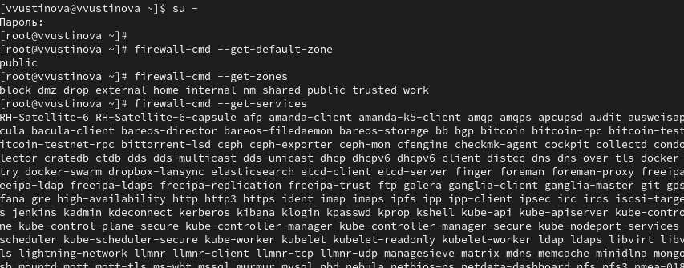{#fig:001 width=70%}

Определите доступные службы в текущей зоне, Сравните результаты вывода информации при использовании команды(рис. [-@fig:002]).

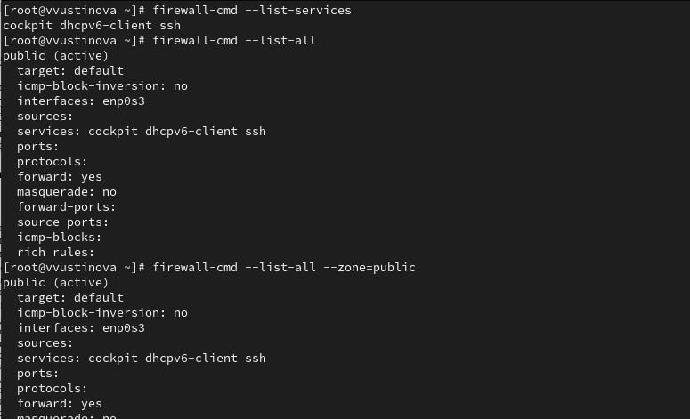{#fig:002 width=70%}

Добавьте сервер VNC в конфигурацию брандмауэра, Проверьте, добавился ли vnc-server в конфигурацию, (рис. [-@fig:003]).

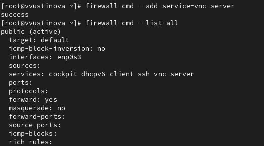{#fig:003 width=70%}

Перезапустите службу firewalld, проверьте, есть ли vnc-server в конфигурации, Добавьте службу vnc-server ещё раз, но на этот раз сделайте её постоянной, исполь-
зуя команду(рис. [-@fig:004]).

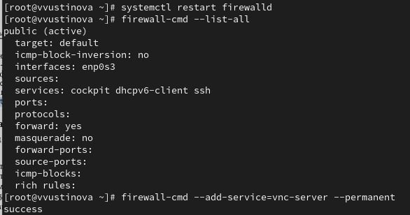{#fig:004 width=70%}

Проверьте наличие vnc-server в конфигурации, Перезагрузите конфигурацию firewalld и просмотрите конфигурацию времени выполнения(рис. [-@fig:005]).

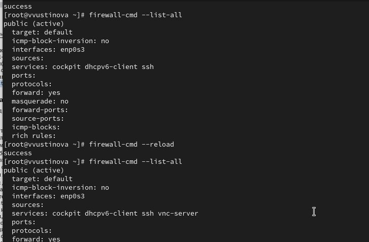{#fig:005 width=70%}

Добавьте в конфигурацию межсетевого экрана порт 2022 протокола TCP, Затем перезагрузите конфигурацию firewalld, проверьте что добавлен(рис. [-@fig:006]).

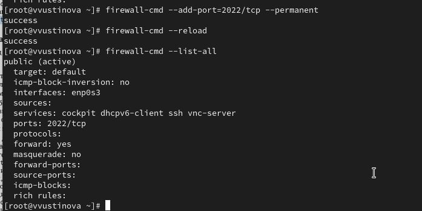{#fig:006 width=70%}

Нажмите выпадающее меню рядом с параметром Configuration . Откройте раскрывающийся список и выберите Permanent Выберите зону public и отметьте службы http, https и ftp, чтобы включить их.(рис. [-@fig:007]).

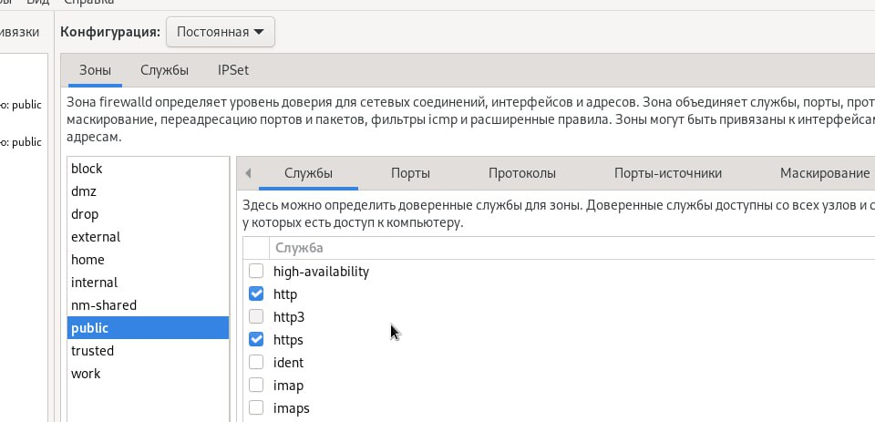{#fig:007 width=70%}

Выберите вкладку Ports и на этой вкладке нажмите Add . Введите порт 2022 и протокол udp, нажмите ОК(рис. [-@fig:008]).

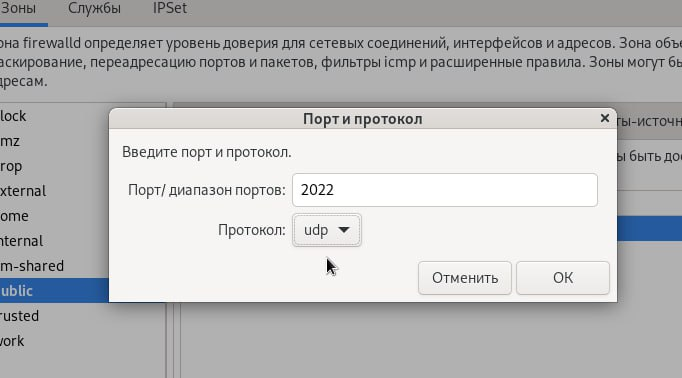{#fig:008 width=70%}

Перегрузите конфигурацию firewall-cmd, и список доступных сервисов(рис. [-@fig:009]).

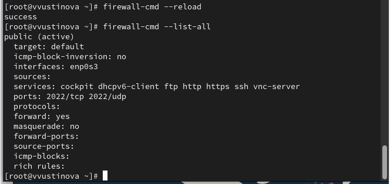{#fig:009 width=70%}

Создайте конфигурацию межсетевого экрана, которая позволяет получить доступ к следующим службам:– telnet;– imap;– pop3;– smtp.(рис. [-@fig:010]).

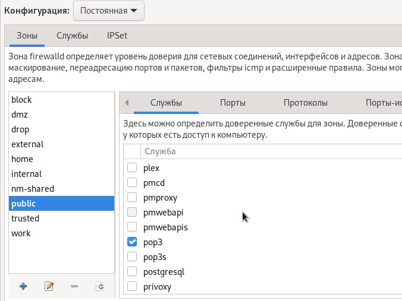{#fig:010 width=70%}

 Создайте конфигурацию межсетевого экрана, которая позволяет получить доступ к следующим службам:– telnet;– imap;– pop3;– smtp.(рис. [-@fig:011]).

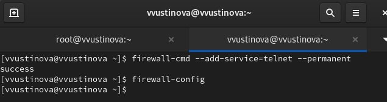{#fig:011 width=70%}

Убедитесь, что конфигурация является постоянной и будет активирована после перезагрузки компьютера(рис. [-@fig:012]).

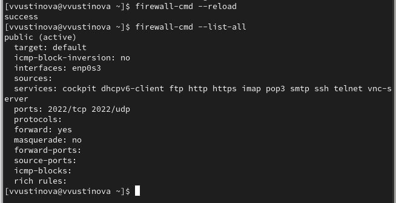{#fig:012 width=70%}

# Выводы

Мы успешно получили навыки настройки пакетного фильтра в Linux.

## Ответы на контрольные вопросы

Вот ответы на ваши вопросы по firewalld:

1. Какая служба должна быть запущена перед началом работы с менеджером конфигурации брандмауэра firewall-config?
  Служба firewalld (или firewalld.service).

2. Какая команда позволяет добавить UDP-порт 2355 в конфигурацию брандмауэра в зоне по умолчанию?
  firewall-cmd --add-port=2355/udp
  (Если зона по умолчанию не public, можно явно указать --zone=public, например: firewall-cmd --zone=public --add-port=2355/udp)

3. Какая команда позволяет показать всю конфигурацию брандмауэра во всех зонах?
  firewall-cmd --list-all-zones

4. Какая команда позволяет удалить службу vnc-server из текущей конфигурации брандмауэра?
  firewall-cmd --remove-service=vnc-server

5. Какая команда firewall-cmd позволяет активировать новую конфигурацию, добавленную опцией --permanent?
  firewall-cmd --reload

6. Какой параметр firewall-cmd позволяет проверить, что новая конфигурация была добавлена в текущую зону и теперь активна?
  firewall-cmd --list-all (показывает всю активную конфигурацию для текущей/дефолтной зоны).
  Или, если вы добавляли что-то конкретное (например, сервис или порт):
  firewall-cmd --query-service=http (проверить сервис)
  firewall-cmd --query-port=80/tcp (проверить порт)

7. Какая команда позволяет добавить интерфейс eno1 в зону public?
  firewall-cmd --zone=public --add-interface=eno1

8. Если добавить новый интерфейс в конфигурацию брандмауэра, пока не указана зона, в какую зону он будет добавлен?
  Он будет добавлен в зону по умолчанию (default zone), которая установлена для вашей системы firewalld. Эту зону можно узнать командой firewall-cmd --get-default-zone.
