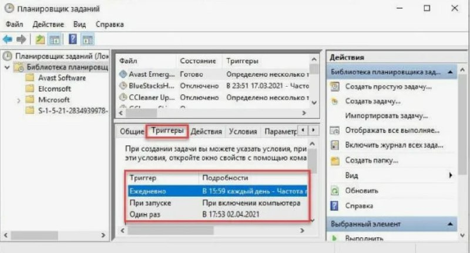
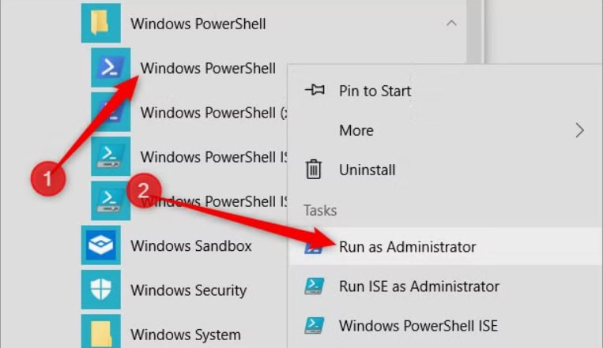
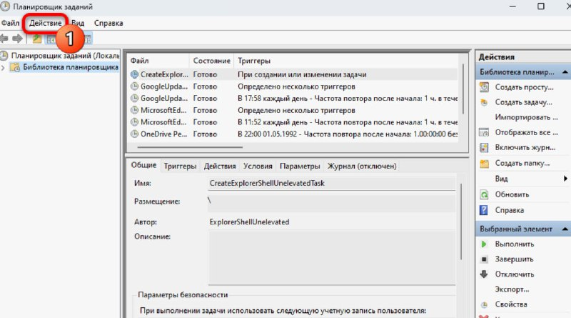

---
## Front matter
lang: ru-RU
title: Планировщик заданий в Windows
subtitle: РОССИЙСКИЙ УНИВЕРСИТЕТ ДРУЖБЫ НАРОДОВ
author:
  - Устинова В. В.
institute:
  - Российский университет дружбы народов, Москва, Россия
date: 10 октября 2025

## i18n babel
babel-lang: russian
babel-otherlangs: english

## Formatting pdf
toc: false
toc-title: Содержание
slide_level: 2
aspectratio: 169
section-titles: true
theme: metropolis
header-includes:
 - \metroset{progressbar=frametitle,sectionpage=progressbar,numbering=fraction}
---

## Докладчик

:::::::::::::: {.columns align=center}
::: {.column width="70%"}

  * Устинова Виктория Вадимовна
  * студент НПИбд-01-24
  * Российский университет дружбы народов
  * [1132243111@pfur.ru](mailto:1132243111@pfur.ru)
  * <https://github.com/vikauustin>

:::
::: {.column width="30%"}

:::
::::::::::::::

# Оглавление

## Cодержание {#cодержание .TOC-Heading .unnumbered}

[1. Вводная часть](#вводная-часть)

[2. Архитектура и ключевые компоненты](#архитектура-и-ключевые-компоненты)

[3. Практика применения в корпоративной среде](#практика-применения-в-корпоративной-среде)

[4. Управление, мониторинг и диагностика](#уравление-мониторинг-и-диагностика)

[5. Безопасность и рекомендации](#безопасность-и-рекомендации)

[6. Интеграция с современными технологиями](#интеграция-с-современными-технологиями)

[7. Ключевые преемущества](#ключевые-преемущества)

[8. Будущее и ИИ](#будущее-и-ИИ)

[9. Выводы](#выводы)

## Вводная часть
*Введение*:

Современные операционные системы представляют собой сложные программные комплексы, требующие эффективного управления ресурсами и автоматизации рутинных операций.

*Актуальность* темы обусловлена:

 * повсеместным распространением ОС Windows в корпоративной и частной средах
 
 * растущими требованиями к надежности, безопасности и эффективности ИТ-инфраструктур.

## Архитектура и ключевые компоненты

Три фундаментальных компонента:

• Триггеры (условия запуска)- определяют момент активации задачи

• Действия (выполняемые операции)-описывают непосредственно выполняемую операцию: запуск исполняемого файла, выполнение скрипта PowerShell

• Условия (дополнительные критерии)-служат дополнительными фильтрами, которые учитывают контекст выполнения

{#fig:001 width=45%}

## Практика применения в корпоративной среде

:::::::::::::: {.columns align=center}
::: {.column width="70%"}

**В системном администрированнии**

1. это автоматическое резервное копирование, очистка диска, проведение инвентаризации: Запуск скриптов, собирающих информацию об аппаратном и программном обеспечени(например, с использованием WMI)

2. Автоматизация бизнес-процессов
• Формирование и рассылка отчетов: Ежедневный или еженедельный запуск скриптов на PowerShell или Python
• Синхронизация данных

3. Обеспечение безопасности

* Регулярные проверки

* Аудит и анализ логов

* Принудительная смена паролей
 
:::
::: {.column width="40%"}

:::
::::::::::::::

## Управление, мониторинг и диагностика

:::::::::::::: {.columns align=center}
::: {.column width="70%"}

Для эффективного использования Планировщика необходимы управление и контроль.

* Графический интерфейс и PowerShell

* Журнал выполнения и диагностика

* Автоматическое восстановление

* Централизованное управление

:::
::: {.column width="45%"}

:::
::::::::::::::

## Безопасность и рекомендации

Рекомендации по защите:

•  Минимизация прав: Использовать учетные записи с минимальными привилегиями.
•  Защита путей: Исполняемые файлы и скрипты должны находиться в защищенных от записи каталогах.
•  Регулярный аудит: Проверять список задач на предмет подозрительной активности (особенно SYSTEM и с непонятными именами).
•  gMSA: Использовать групповые управляемые учетные записи служб для автоматической смены паролей (в доменной среде).

{#fig:004 width=45%}

## Интеграция с современными технологиями

| Глубокая интеграция | PowerShell | 
| :--------: | :--------: | 
| Взаимодействие | облачными платформами | 
| Поддержка | гибридных сред | 

{#fig:005 width=45%}

## Ключевые преемущества

:::::::::::::: {.columns align=center}
::: {.column width="70%"}

 Во-первых, это комплексная автоматизация рутинных операций
 Во-вторых, существенное повышение надежности систем за счет исключения человеческого фактора и обеспечения стандартизированного выполнения критически важных процессов
 В-третьих, заметное снижение операционных затрат благодаря оптимизации использования ресурсов и предотвращению простоев

• Автоматизация рутинных операций

• Повышение надежности систем

• Снижение операционных затрат

• Круглосуточная работоспособность

:::
::: {.column width="48%"}

:::
::::::::::::::

## Бущущее и ИИ

:::::::::::::: {.columns align=center}
::: {.column width="70%"}

Возможности:

1. AI-оптимизация расписаний

2. Прогнозный анализ сбоев

3. Интеллектуальное распределение ресурсов

4. Автономное принятие решений

:::
::: {.column width="48%"}

:::
::::::::::::::

## Выводы
 
В заключение хочу подчеркнуть: 
Планировщик заданий – это не просто инструмент для автоматизации, а стратегический компонент ИТ-инфраструктуры. Его грамотное использование позволяет не только автоматизировать рутину, но и повысить надежность систем, снизить операционные затраты. В перспективе можно увидеть использование искусственного интеллекта для оптимизации расписаний и расширенную аналитику выполнения задач

